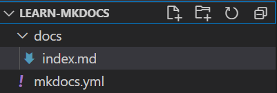
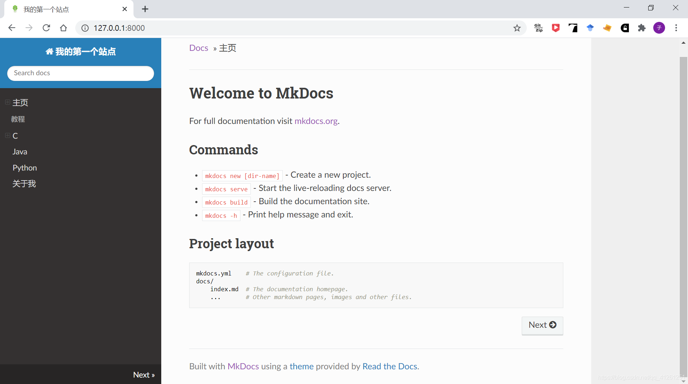

# 使用指南
## 1.介绍
本项目使用mkdocs开源项目辅助生成项目网页文档并与GitHub连接由GitHub提供文档地址
## 2.mkdocs安装
安装mkdocs前需要安装python环境。mkdocs要求python版本为：python 3.5、python 3.6 、python 3.7和python 3.8。

安装mkdocs非常简单，只需要在控制台运行如下命令即可：

`pip install mkdocs`

查看mkdocs是否安装成功，只需要运行如下命令：

`mkdocs --version`

如果提示不能运行mkdocs命令，简单的解决方法只需要在命令前加上python -m，即：

`python -m mkdocs --version`

永久的解决方法是将python安装目录下的Scripts加入环境变量Path中。

## 3.mkdocs简单使用

### 1.创建一个基本的mkdocs并使用

我们只需要运行如下命令，就可以创建一个站点：

`mkdocs new dir_name`

这个命令会在当前目录下创建一个目录（dir_name）。注意：dir_name可以选择自己喜欢的名字。


该目录结构如下：



在创建的目录下，有一个子目录docs，其中包含了源文件、页面等数据；
在创建的目录下，有一个文件mkdocs.yml，这就是配置文件；
然后进入我们创建的目录learn_mkdocs，运行如下命令，即可在本地访问站点：

`mkdocs serve`


在浏览器输入地址http://127.0.0.1:8000，页面如下：


在运行站点的同时，我们可以实时修改站点信息，mkdocs会更新并展示在浏览器上，方便我们预览。

我们可以修改mkdocs.yml文件中的站点名site_name：

`site_name: 我的第一个站点`


### 2.添加页面

前面mkdocs为我们创建了一个页面`index.md`，我们同样可以自己添加页面，比如，在`docs`目录下创建页面`about.md`，页面内容如下：

```markdown
# 关于我
## 我叫什么
水木子
## 我的身份
学生
## 我来自哪里
重庆
```

然后在配置文件`mkdocs.yml`中添加以下配置项：

```yml
nav: 
  - 主页: index.md
  - 关于我: about.md
```

浏览器显示效果如下：


这样我们就成功地添加了一个页面。我们也可以添加多级页面，首先在`docs`目录下新建一个目录，此处命名为`Tutorial`，然后再该目录下创建文档，此处创建三个文档：`C.md`、`Java.md`和`Python.md`。目录结构如下：


```yml
nav: 
  - 主页: index.md
  - 教程:
    - C: Tutorial/C.md
    - Java: Tutorial/Java.md
    - Python: Tutorial/Python.md
  - 关于我: about.md
```


除了在导航栏上设置页面，我们也可以在页面上通过markdown语法进行跳转：`[文字](要跳转的地址)`

比如，在`about.md`中要跳转到`Java.md`页面：`[去Java.md页面](./Tutorial/Java.md)`当你点击这个链接时，就会跳转到对应的页面：


### 3.更改主题

mkdocs默认有两个主题：mkdocs和readthedoc，默认使用mkdocs。我们在配置文件中修改，使用`readthedocs`主题：

```yml
theme:
  name: readthedocs
```



我们也可以使用第三方主题，第三方主题详细列表如下：https://[github](https://so.csdn.net/so/search?q=github&spm=1001.2101.3001.7020).com/mkdocs/mkdocs/wiki/MkDocs-Themes。可以参照具体的主题使用教程，进行配置。在本例中，我们配置一个名为`material`的主题。

首先利用`pip`下载相应的主题：`pip install mkdocs-material`，然后在配置文件中修改主题：

```yml
theme:
  name: material
```


### 4.部署到GitHub

当你尽心尽力地输出文档后，你不希望这些内容只能自己在本地看吧，你还是希望将这些文档部署到服务器上，让其他人也能看。本小节就讲解如何部署文档到服务器上。首先来认识一个命令:`mkdocs build`


这个命令会在`learn-mkdocs`目录下生成一个目录`site`，这个目录中包含了静态站点的页面内容。


#### 1.连接到GitHub

我们可以在GitHub中创建一个仓库，名为`mymkdocs`。然后在`learn-mkdocs`下打开git，并将当前目录设置为一个仓库，然后与GitHub新创建的仓库`mymkdocs`连接：

```git
git init
git remote add origin https://github.com/你的GitHub名字/你的项目名字.git
```

然后在`learn-mkdocs`目录下打开控制台，执行命令：`mkdocs gh-deploy`。这个命令会在GitHub项目上创建一个`gh-pages`分支，并执行`mkdocs build`命令，然后将当前目录中的`site`目录下的内容推送到远程的`gh-pages`分支：


浏览器访问`http://你的GitHub名字.github.io/你的项目名字`即可：


#### 2.个人页面

个人页面与项目页面不同的是站点放在一个特殊的仓库中，这个仓库的名字为`{your_github_usernmae}.github.io`，这样我们就可以通过`https://{your-github-username}.github.io`访问到我们的站点了，不用再加项目名了。首先在GitHub创建一个特殊的仓库，名字为`{your_github_usernmae}.github.io`，然后在本地`learn-mkdocs`同级目录下创建一个与GitHub仓库同名的文件夹，作为本地仓库。将本地仓库与远程仓库绑定在一起：


打开控制台，找到本地仓库的位置，然后执行下面的命令：`mkdocs gh-deploy --config-file ../{learn-mkdocs}/mkdocs.yml --remote-branch master`

需要注意的是，您需要显式指向`mkdocs.yml`配置文件，因为它不再位于当前工作目录中。 您还需要通知部署脚本提交到`master`分支


浏览器访问`https://{你的GitHub的名字}.github.io`，即可访问部署的站点：


> ​	注意：部署在GitHub之后每一次更新都需要执行命令`mkdocs gh-deploy`，建议现在本地更新完达到效果之后再推送至GitHub
