## 1.项目准备

​	本项目使用python+QT构建，使用QT实现软件的界面设计，使用python完成算法设计。项目环境建议使用conda构建虚拟环境，python版本建议为3.6。项目需要的软件包包括：PyQt5，matplotlib，numpy，pandas，pymysql，reportlab，pyinstaller

> ​	pip install PyQt5 -i https://pypi.tuna.tsinghua.edu.cn/simple

​	在项目开发中可能会使用到pythonocc这个软件包，在这里也给出安装方法：

> ​	安装pythonOCC的7.4.0版本使用命令：conda install -c dlr-sc -c pythonocc pythonocc-core=7.4.0rc1
>
> ​	（推荐）安装pythonOCC的7.4.1版本使用命令：conda install -c dlr-sc -c pythonocc pythonocc-core=7.4.1

​	在项目开发时建议安装QT，使用QT设计界面会大大加快软件的开发，QT安装教程参考[Qt：windows下Qt安装教程_OceanStar的学习笔记的博客-CSDN博客](https://blog.csdn.net/zhizhengguan/article/details/107567449)

## 2.项目说明

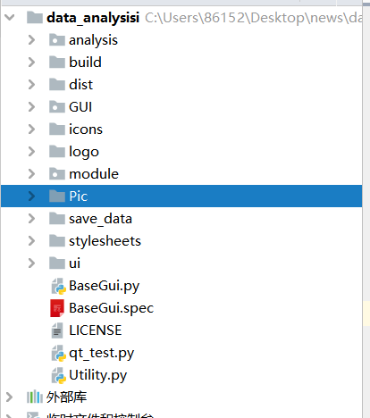

​	整个项目结构如图所示，项目中的build，dist不需要我们关注，因为这是生成exe文件时自动生成的，我们主要需要关注的在于analysis，GUI和ui文件，其中analysis文档主要用于算法设计，所有的算法都放在这个文件下面，可以根据自己的算法动态的加入，但需要注意的是，其中的算法必须保证操作数据库与不操作数据库的部分隔开，算法仅仅使用数据而不涉及数据库的操作，需要将数据库的操作单独分离出来，具体结构如下所示

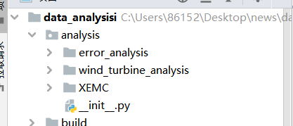

​	其次我们需要关注的就是GUI文件了，其中的需要我们重点关注的便是ribbon_main.ini文件，至于其它文件可以暂时忽略，在这里不做赘述，ribbon_main文件主要用于设计项目的顶部导航栏，至于具体参数设计将在后面阐述。在这里我们只需要知道GUI文件中有配置文件需要我们修改即可，至于其它文件建议不懂即可。

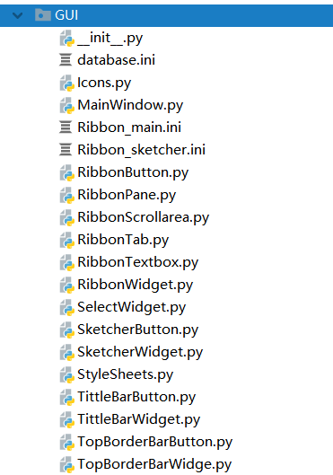

​	项目重点需要关注的是ui文件和module文件下的**DisplayManager**文件，其中的ui文件下包含了所有的页面设计，也就是所有的tab页设计全部放在ui文件下面，至于DisplayManager文件则是软件的主界面，整个软件在该文件中布局，具体的结构如下所示：

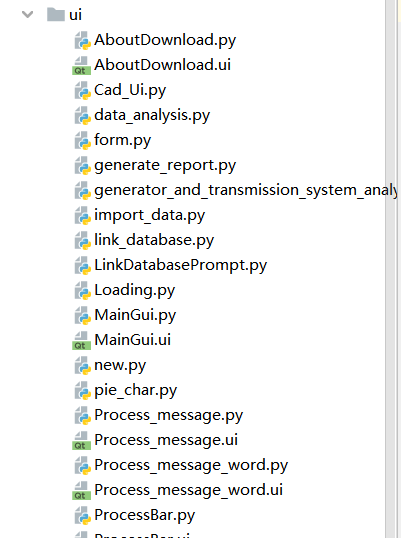

​	项目中还有一个文件是save_data文件，该文件存储的是项目算法分析的结果，算法分析画的所有图和结果都存储在该文件下，该文件一开始为空，但需要注意的是，需要在该文件下保留文件content.ini和database.ini，content存储图片路径、分析结果等等内容，而database存储连接数据库信息，而一开始这两个文件可以需要为空但必须保留空文件，因为在我们打包程序为exe文件时，程序会默认将文件都存储在用户的AppData中，而一般用户的AppData是不允许修改的，所有在动态创建文件时可能会报错，所以建议在save_data文件下保留这两个文件，至于后续开发也可以根据自己的需要加入文件，但所有用户的文件都必须存储在save_data文件下，因为文件保存和导入都是对这个文件进行操作，具体文件结构如下所示：

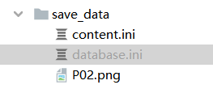

## 3.项目使用

​	在网站获得代码之后，使用conda虚拟环境安装好所有需要的包，直接运行文件BaseGui.py即可，具体的效果如下所示：

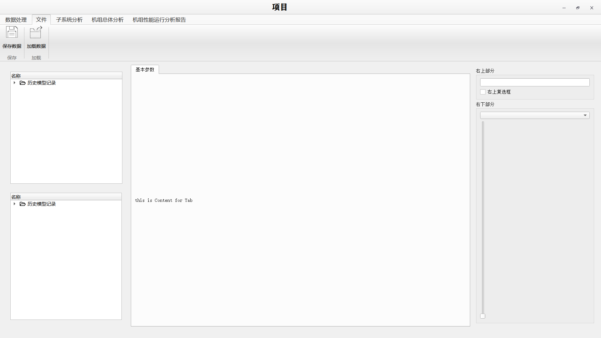

## 4.项目修改

### 1.修改配置文件

​	配置文件Ribbon_main具体内容如图所示：

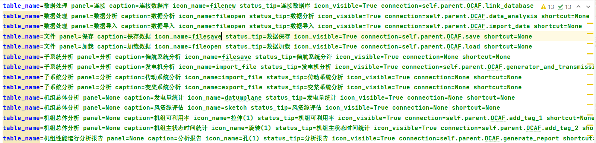

​	其中配置文件的所有内容都是顶部导航栏的设计，其中table_name参数是导航栏的大类，也就是最上面的部分，参数panel则是大类中的小类，通俗来讲，一个大类中有多个功能，但可能多个功能又可以细分为多个小功能，而参数panel则是细分的小功能，如果没有细分的小功能则直接删除panel也可以，参数caption则是细分的功能说明也就是图片下面的说明，参数icon_name则是功能的图标，而图标具体放在文件icons下面，如需修改则将图标文件放入icons下即可，参数status_tip则是当鼠标停靠在某一个功能上时显示的说明，参数icon_visible则是表示图片是否可用，通常直接设置为True即可，参数connection则是将功能连接到某一个函数，可以是某一个功能也可以是具体都某一个tab页。

​	如需修改，建议直接复制其中某一行直接修改参数即可，如果觉得参数可读性不高需要修改，也可以修改参数名，无硬性要求，修改了参数名之后也需在后续的应用文件中修改，至于具体应用内容则在文件module中的ShowGui文件中，具体代码如下所示

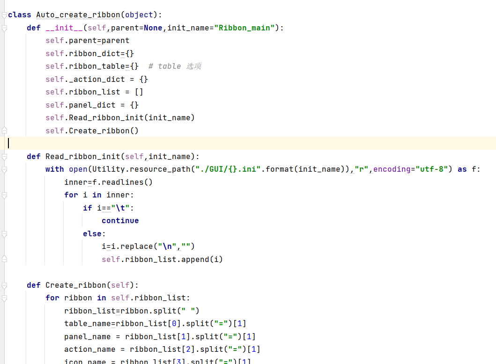

​	这里的配置文件仅仅是顶部的导航栏，在后续开发中建议仅修改Ribbon_main中的内容即可，直接复制某一行修改其中参数即可。

### 2.设计软件界面

​	该软件的所有界面都是由QT实现，而在我们开发过程中可以使用QT提供的Designer来设计界面，具体界面如下所示：

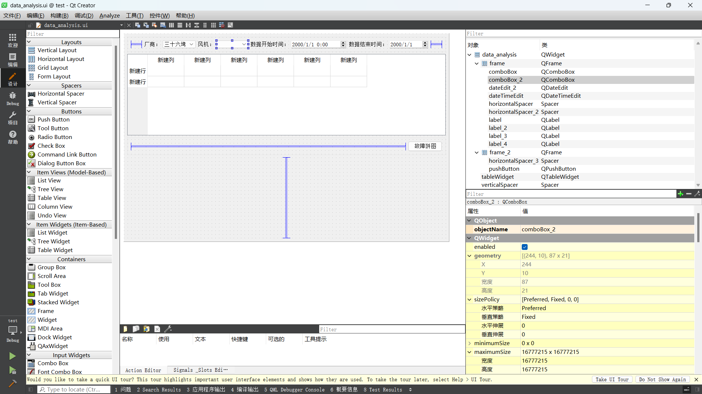

​	从图中我们可以看到QT提供的设计界面由两部分组成，分别是左边的组件库和右边的部署空间，我们可以根据需求从左边的组件库中选出需要的组件放入右边的空间，注意左边组件库中的所有组件都是有用的，需要开发者理解组件并适当的应用，特别是Spacers弹簧组件，这个组件配合布局可以设计出比较整洁的页面、

​	我们在QT设计完成页面之后，找到设计的源文件，它都后缀一般是.ui，然后在源文件的文件夹下新建一个文件，在文件中键入`pyuic5 -o generate_report.py generate_report.ui`，然后修改文件后缀为.bat，然后运行该bat文件，该文件会将在QT中设计的UI文件转换成python中的类，在后续使用中会非常方便。如果对于QT转python还有疑问具体参考博客：[PyQt完整入门教程 - lovesoo - 博客园 (cnblogs.com)](https://www.cnblogs.com/lovesoo/p/12491361.html)，如果对于在python中使用QT有疑问看具体参考博客：[介绍 - PyQt 中文教程 (gitbook.io)](https://maicss.gitbook.io/pyqt-chinese-tutoral/pyqt5/index)和[Python 小白从零开始 PyQt5 项目实战（8）汇总篇（完整例程）_pyqt5项目_youcans_的博客-CSDN博客](https://blog.csdn.net/youcans/article/details/120925109)

> ​	注意：所有的界面设计的python文件都需要放在ui文件夹下以便统一管理

### 3.新增tab页

​	在我们使用QT设计完界面并转换成python类之后，我们需要将界面展示出来，由于项目整体框架已经写好了，接下来我会用项目中的一个示例进行说明，给出后续开发中需要修改的地方，首先我们在QT中设计了一个导入数据的界面如下所示：

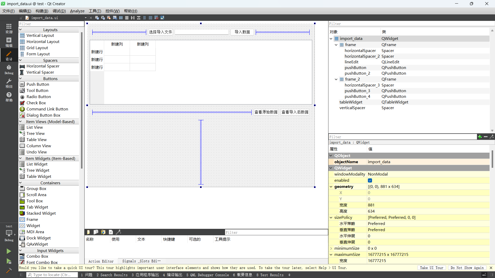

然后通过bat文件将ui界面转换成python文件，具体内容如下所示：

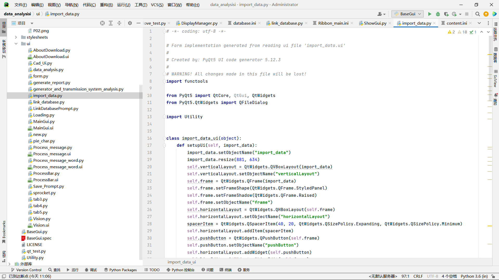

​	对于自动生成的python文件我们无需修改即可直接使用，同时我们需要将配置文件进行修改，在导航栏中加入导入数据模块，并添加点击事件，具体改动如下所示：

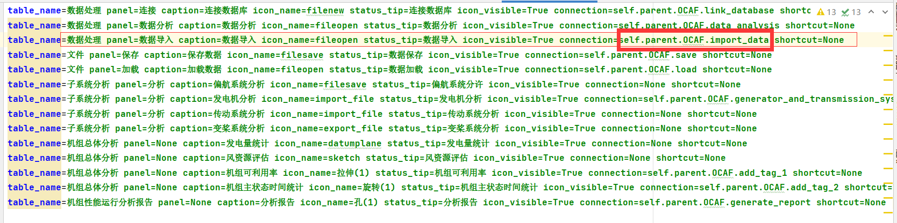

​	我们需要重点关注的connection参数的点击事件，这里的点击事件写在module文件夹下的OCAFModule.py中，这个文件主要是一个过度文件，我们需要重点关注的内容在module文件下的DisplayManager文件中，具体如下所示：

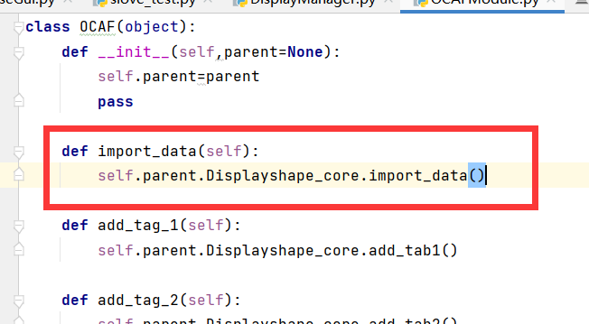

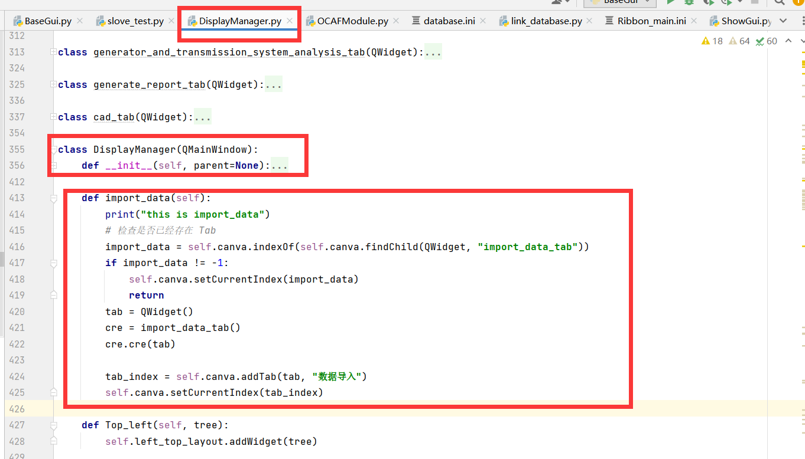

```python
# 在displaymanager类中新增一个方法来添加tab页
def import_data(self):
    print("this is import_data")
    # 检查是否已经存在 Tab，如果已经存在则无需新增tab页否则新增tab页，其中"import_data_tab"是tab页的id
    import_data = self.canva.indexOf(self.canva.findChild(QWidget, "import_data_tab"))
    if import_data != -1:
        self.canva.setCurrentIndex(import_data)
        return
    tab = QWidget()
    # 新建tab页
    cre = import_data_tab()
    cre.cre(tab)
    # 将新增的tab页加入整个tab页的组件中，其中"数据导入"为tab页的标题
    tab_index = self.canva.addTab(tab, "数据导入")
    self.canva.setCurrentIndex(tab_index)
```

```python
# 每一个新增的tab页都需要在文件displaymanager中新增一个类来创建tab页
# 注意，在新增类时直接复制然后修改相应的类即可，整体流程是无需修改的
class import_data_tab(QWidget):
    def __init__(self):
        super(import_data_tab, self).__init__()

    def cre(self, tab):
        tab.setObjectName("import_data_tab")  # 设置对象名以便后续查找
        # 设置tab页的布局
        layout = QHBoxLayout(tab)
        baseW = QtWidgets.QWidget()
        # 这是通过.ui转成的python类，import_data_ui就是转成的类
        ui = import_data_ui()
        ui.setupUi(baseW)
        layout.addWidget(baseW)
```

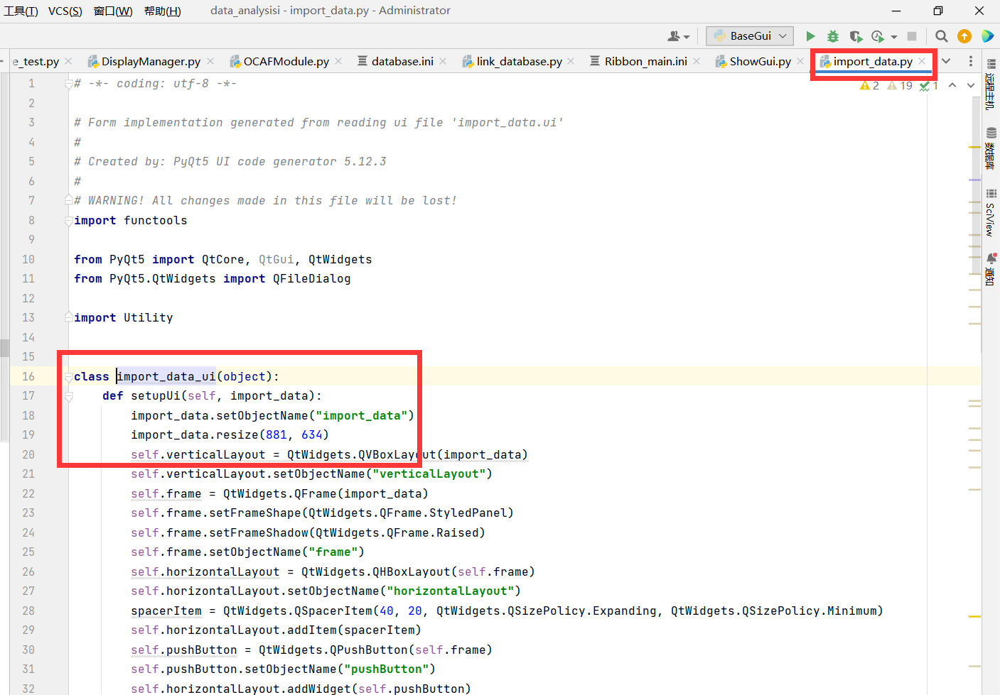

​	注意，生成的python无需修改即可直接使用，我们只需要给对于的按钮添加点击事件即可，至此添加tab页的整个流程就结束了，最后实现的效果图如下所示：

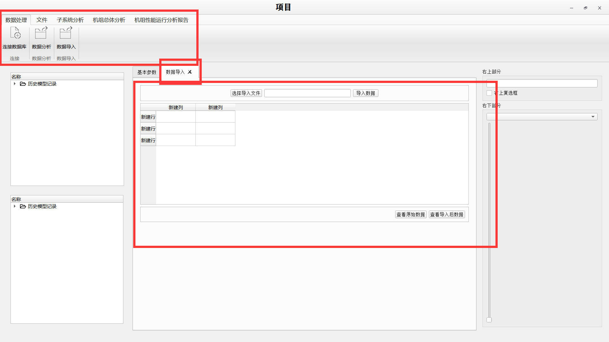

### 4.设计算法

​	本项目的算法一般只涉及到数据的处理，一般包括：导入数据，分析数据，根据数据画饼图、柱状图以及根据数据给出分析评语等等，所以所有的算法可以作为一个单独的模块，也就是说我们的算法需要独立于项目，项目仅仅是调用我们的算法，具体算法结构如下所示：

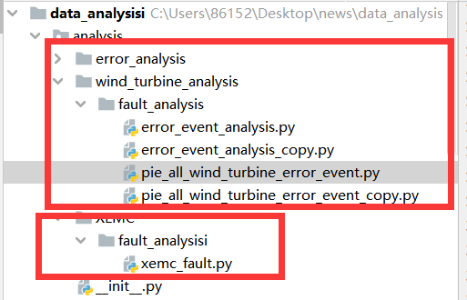

​	analysis文件上面部分就是算法，由于实现一个功能可能需要多个算法一起实现，所以建议一个功能一个文件，功能还能进行细分，通过不同文件夹来细分管理，而下面部分则是对算法的调用，可以在下面部分对算法进行测试使用，注意，上面部分的算法不能出现对数据库的调用，所有关于数据库的调用都应该拿到外面使用，也就是说算法仅仅涉及到数据的处理，比如将数据处理成什么格式，根据数据画图，根据数据给出评语等，而对数据库的操作，如将数据传入数据库，从数据库获取数据这些都应该写在项目中，或者写在下面部分对算法进行测试使用。

​	在我们编写算法时需要严格遵守PEP8的标准，对于一个写好的完整算法必须严格遵守这个标准，如果是在pycharm中编写代码，编译器会自动检查代码的格式是否满足PEP8的标准，具体如下所示：

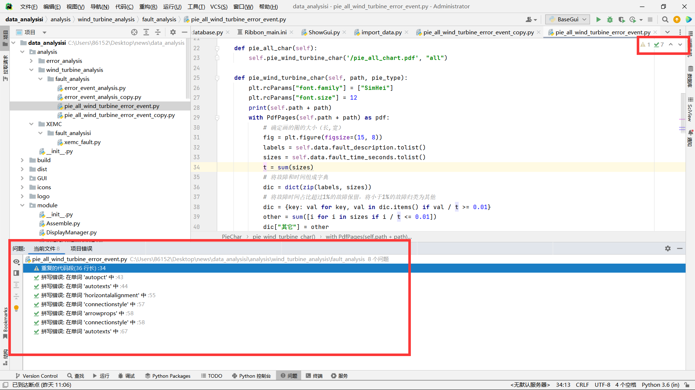

​	在编译器的右上角，我们可以看到文件的所有警告，当我们点击警告是会弹出下面的警告，会具体告诉你哪一行代码不满足PEP8标准，当我们不知道我们的算法是否满足PEP8标准时，我们只需要查看文件是否有警告即可，需要去除所有的警告才能表示该算法已经编写完成。任何不满足PEP8标准的算法都不允许使用！如果你需要进一步了解PEP8规范请参考文档：[PEP 8 -- Style Guide for Python Code |《PEP 代码规范格式文档归纳》| Python 技术论坛 (learnku.com)](https://learnku.com/docs/styleofcode/PEP_8/7084)

### 5.部分文件说明

> ​	对于该项目，我们需要重点关注的不多，但是项目中的部分文件是需要我们深入理解的

​	首先我们需要关注的就是showgui这个文件，这个文件是我们运行程序时第一个展示的界面，这个界面总共包括六个部分，都已经模块化处理，如需对某一个部分进行修改仅需对某一个模块进行修改即可，六个部分分别为：顶部导航栏、左上部分ui、左下部分ui、中间tab页展示ui、右上部分ui、右下部分ui，具体实现都在文件的init部分，具体细节参考代码，具体代码如下所示：

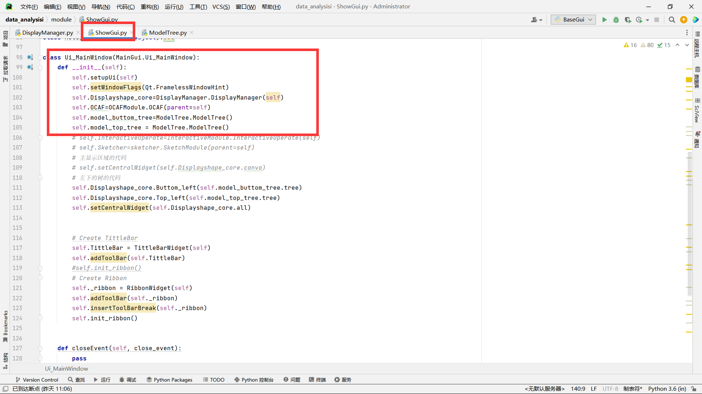

```python
class Ui_MainWindow(MainGui.Ui_MainWindow):
	def __init__(self):
		self.setupUi(self)
		self.setWindowFlags(Qt.FramelessWindowHint)
        # 中间tab展示部分
		self.Displayshape_core=DisplayManager.DisplayManager(self)
		self.OCAF=OCAFModule.OCAF(parent=self)
		# 左下部分的树
        self.model_buttom_tree=ModelTree.ModelTree()
		# 左上部分的树，如果项目需要对树进行修改，修改ModealTree中代码即可
        self.model_top_tree = ModelTree.ModelTree()
		# 左下的部分绑定树代码
		self.Displayshape_core.Buttom_left(self.model_buttom_tree.tree)
		# 左上部分绑定树代码
        self.Displayshape_core.Top_left(self.model_top_tree.tree)
		self.setCentralWidget(self.Displayshape_core.all)
		# Create TittleBar，最顶部的部分，就是编写右侧缩小，关闭的部分，具体请参考代码
		self.TittleBar = TittleBarWidget(self)
		self.addToolBar(self.TittleBar)
		#self.init_ribbon()
		# Create Ribbon 顶部按钮部分
		self._ribbon = RibbonWidget(self)
		self.addToolBar(self._ribbon)
		self.insertToolBarBreak(self._ribbon)
		self.init_ribbon()
```

具体的六个部分如下所示：

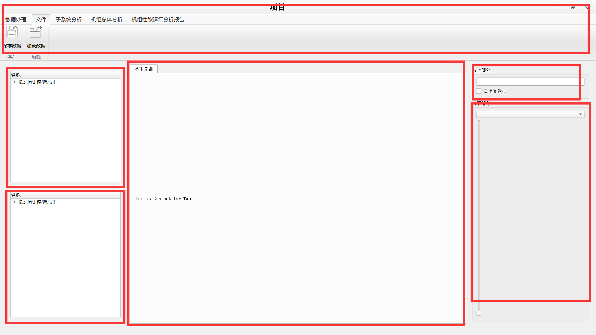

​	而另一个需要我们关注的便是DisplayManager这个文件，我们需要深入理解它的作用，以及我们在后续开发中需要如何修改并加入内容，首先，第一部分我们无需关注，这些代码或许在后续开发中会用到也或许不会，而值得关注的第二部分则是每一个tab页的类，当我们新增一个tab页时都需要新增一个类来方便管理，一般来说我们只需要复制其中的某一个类然后修改部分关键代码即可，在后面我会给出需要修改的部分。

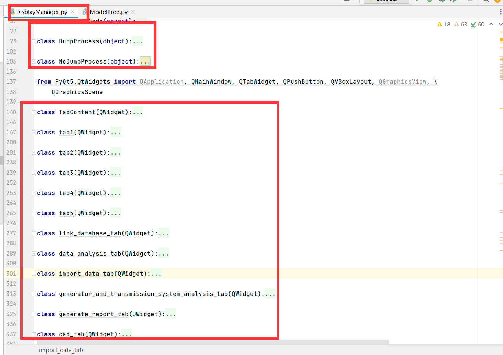

​	而在displaymanager类中，则编写了关于界面的大体布局，所有布局内容都在init中编写，包括各个部分，init这部分代码一般不需要修改，一般只需要根据需求新增参数

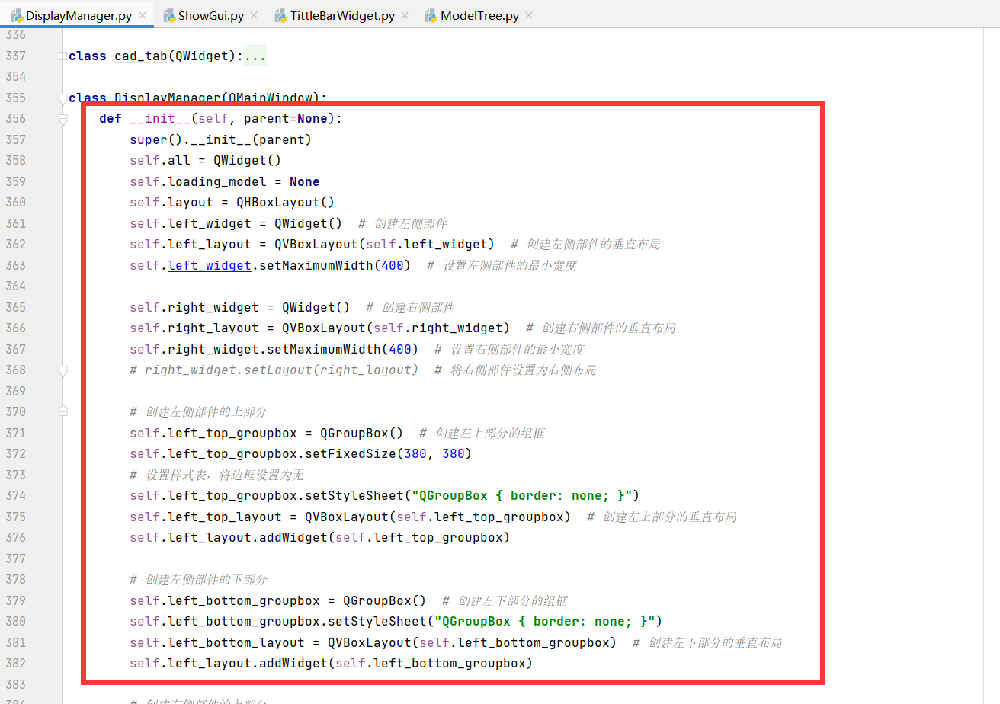

​	而DisaplayManager的函数部分大部分都是对在外面的tab类的调用展示，一般来说这一部分的代码也只需要外面复制其中的某一个函数然后修改部分关键代码即可，如果需要改变部分的布局，修改左上、左下、右上、右下部分的代码即可，而新增tab页就是函数的调用

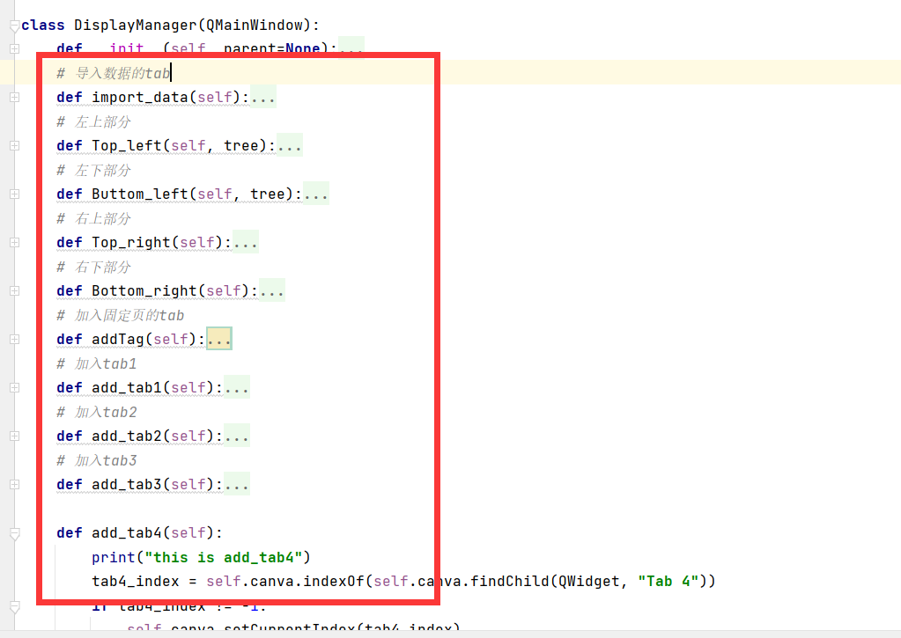

​	对于新增tab页，我们可以关注一下add_tab3和add_tab4函数，我们会发现它们大部分都是相同的我们只需修改不同的部分即可，当然在后续开发中可以考虑将这些进行整合

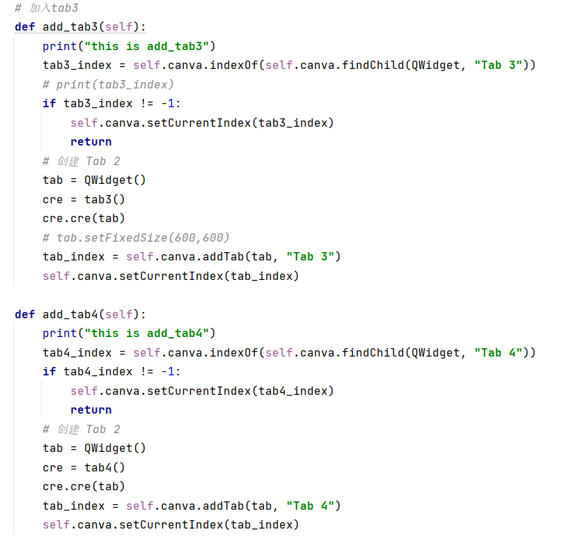

​	当然，对于外面的tab类我们也只需关注不同的部分即可，修改这些不同的部分便可将所有自己编写的界面展示出来，而对于不同界面的不同业务都应该在ui类中进行代码编写

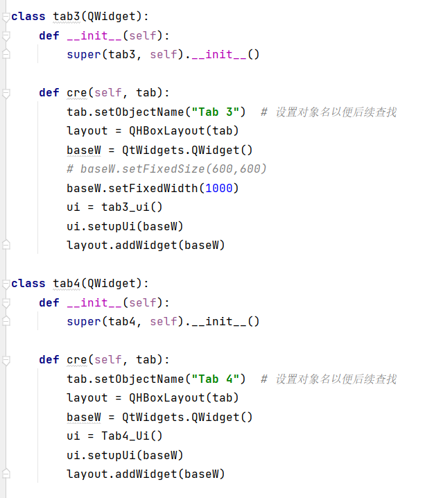