# 1.项目需求

## **1.子系统分析**

### **1.**变流、水冷系统分析

​	所用数据参数较为特殊，需湘电提供相应分析计算过程，暂时不做

### **2.**偏航系统分析

​	主要包括偏航次数统计、偏航执行时间统计、解缆次数统计、偏航间隔时间统计；最大液压压力平均值、最大液压压力、最大偏航刹车压力、最大建压速度、风向变化总角度、总偏航圈数、总偏航次数、发电状态偏航总次数、未 偏航时滑移总角度、发电状态下滑移角度最大值、非发电状态下的滑移角度最大值、总偏航时间（h）、发电状态最大偏航时长等数据分析、对比。

偏航次数统计，利用数据表中的总偏航次数参数进行计算，计算方式为最终时间点的数值减去起始时间点的数值。

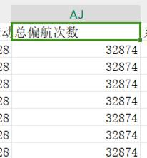

​	偏航执行时间统计需湘电提供计算方式，预留图表。

​	解缆次数统计，利用数据表中的总解缆转速参数进行计算，计算方式为最终时间点的数值减去起始时间点的数值。

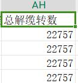

​	偏航间隔时间统计计算方式为两次偏航之间的间隔。利用总偏航次数进行计算，当次数发生变化时，统计未变化的时间长度。

​	该部分可绘制三个图，一个为直方图，横坐标为偏航次数、解缆次数，纵坐标为次数；二为折线图，横坐标为次数(第一次，第二次等等)，纵坐标为偏航间隔时间，显示每次偏航的时间间隔长度；三为偏航执行时间图，暂时预留。

注：所使用的数据最好是秒级。

### **3.发电机、传动系统分析**

​	主要包括发电机定子温度、间隙温度、主轴承温度、齿轮箱温度等数据的分析、对比。

​	绘制发电机定子温度、间隙温度、主轴承温度、齿轮箱温度四个参数的时序变化折现图。使用10min分辨率的数据。

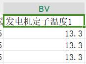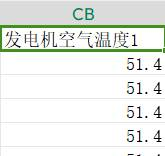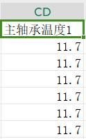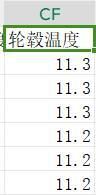

### **4.变桨系统分析**

​	主要包括变桨电机电流、变桨系统温度、后备电源电压、后备电源充电效率、变桨电机温度等数据对比、分析。

​	绘制变桨电机电流、变桨系统温度、后备电源电压三个参数的时序变化折现图。使用10min分辨率的数据。后备电源电压暂时不绘制，预留图。

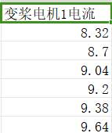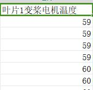

## **2.机组总体分析**

### **1.发电量统计分析**

​	主要是全场发电量、各机组月发电量、日发电量统计分析。所用参数为总发出的有功电量。可使用10min分辨率数据。

​	机组日发电量计算方式为每日的结束时间与起始时间的有功电量之差。

​	机组月发电量计算方式为每月的结束时间与起始时间的有功电量之差。

​	全场发电量计算方式为各机组的月发电量之和。

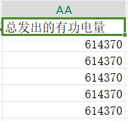

​	绘制三种图，机组日发电量折现图横坐标为时间，以日为单位，纵坐标为日发电量；机组月发电量折现图横坐标为时间，以月为单位，纵坐标为月发电量；整体发电量折线图横坐标为时间，以月为单位，纵坐标为月总发电量。

### **2.风资源评估分析**

​	各机组风速时序、风频分布、风向玫瑰图、湍流强度等，并绘制相关曲线。使用10min分辨率数据，所使用的参数为风速、风向参数。

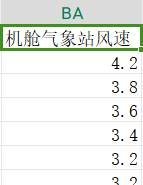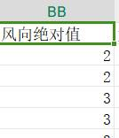

​	绘制四种图：风速时序图横坐标为时间，纵坐标为风速大小；风频图示意如图横坐标为风速大小，纵坐标为频次；风向玫瑰图示意如图；湍流强度图暂不绘制，预留图。

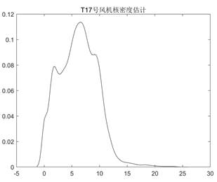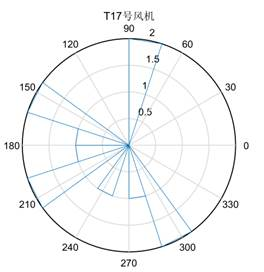

### **3.机组可利用率分析**

​	各机组月可利用率、年可利用率对比分析。可使用功率参数进行判断，功率≤0则未发电。使用10min 分辨率数据。

​	各机组月可利用率=100%*月发电时间/月总时间

​	年可利用率=月可利用率之和/12

​	绘制一种图，月可利用率图，横坐标为时间，月为单位，纵坐标为月可利用率。

### **4.机组主状态时间统计分析**

​	各机组日发电时间、日待机时间、日维护时间、月发电时间、月待机时间、 

​	月维护时间、月维护时间等。使用10min分辨率数据。所使用的参数为功率和转速。

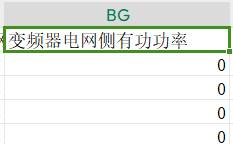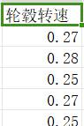

​	日发电时间=功率>0的时间总长

​	日待机时间=功率≤0且转速>0的时间总长

​	日维护时间=功率≤0且转速<0的时间总长

​	月发电时间=日发电时间的时长总和

​	月待机时间=日待机时间的时长总和

​	月维护时间=日维护时间的时长总和

​	绘制6种图：月发电时间图，横坐标为日期，日为单位，纵坐标为时间；月待机时间图，横坐标为日期，日为单位，纵坐标为时间；月维护时间图，横坐标为日期，日为单位，纵坐标为时间；年发电时间图，横坐标为日期，月为单位，纵坐标为时间；年待机时间图，横坐标为日期，月为单位，纵坐标为时间；年维护时间图，横坐标为日期，月为单位，纵坐标为时间；

​	注：月发电时间图、月待机时间图、月维护时间图可折叠到一张图，通过下拉选择查看不同图。年发电时间图、年待机时间图、年维护时间图可折叠到一张图，通过下拉选择查看不同图。

### **5.机组安全性能分析**

​	主要包括对后备电源容量、紧急收桨速率、机组振动数值、偏航扭缆值、超速传感器数值等数据对比、分析；同时结合机组事件列表（故障报表）对安全链相关故障进行故障统计及安全链测试情况统计；对机组安全性能进行评估。

### **6.机组发电性能分析**

​	主要包括机组平均风速、年平均风速、理论电量、实际电量、功率曲线、转矩-转速曲线、转速-桨距角曲线、风速-转速曲线、风速-桨距角曲线、叶尖速比等数据分析；对机组发电性能进行评估；

### **7.故障统计分析**

机组在故障过程中可能会同时报出多个故障，因此在进行故障统计时需剔除其中的衍生故障，只对主故障进行统计（一般为首故障）。故障统计分析主要包括故障分类统计排名、各机组故障分类统计排名、各机组故障次数统计排名、故障共性及个性分析四个模块。

（1）故障分类统计排名 

​	机组根据大部件类型（如变桨系统、变流系统、发电机、偏航系统、传动系统、润滑系统等）对机组历史故障进行分类统计，并按时间、次数等条件进行占比、排名对比。

（2）各机组故障分类统计排名

​	各机组按大部件故障类型（如变桨系统、变流系统、发电机、偏航系统、传动系统、润滑系统等）进行故障排名。 

（3）各机组故障次数统计排名

​	按机组历史故障实际次数进行统计排名。 

（4）故障共性及个性分析

​	根据故障统计结果，对故障次数高、故障频次高、重复出现的故障以及故障率较高的机组进行故障原因分析，并提供参考解决方案，及时提示维护人员进行故障处理。

### **8.振动分析**

​	主要包括全场振动幅度统计图、各机组振动水平、各机组劣化趋势三个模块。

（1）全场振动幅度统计图 

​	根据全场风机机舱振动数值绘制全场左右、前后振动幅度统计图

（2）各机组振动水平

​	根据各机组机舱振动数值，按小风、普风、满发、大风等情况绘制各机组左右、前后振动水平柱状图。 

（3）各机组劣化趋势

​	在风况、功率等条件相似状态下，对各机组最近振动水平与历史振动水平进行对比分析。

### **9.温度分析**

​	主要包括各机组发电机温度、主轴承温度、齿轮箱温度、变流器温度数据对比分析。

### **10.机组劣化趋势分析**

​	主要包括机组前后时间发电量、可利用率、关键部件温升、故障次数、故障停机时长等数据对比分析。

### **11.机组性能评分**

​	根据机组数据自动分析结果，对机组总体性能进行打分。

# 2.项目说明

## 1.子系统分析说明

### 1.变流、水冷系统分析说明

​	由于数据暂时不足，暂不实现

### 2.偏航系统分析

### 3.发电机、传动系统分析

​	由需求说明可知，该功能主要实现发电机定子温度、间隙温度、主轴承温度、齿轮箱温度四个参数的时序变化折现图，且使用的是十分钟数据，所以，根据需求可得到结果如下所示：

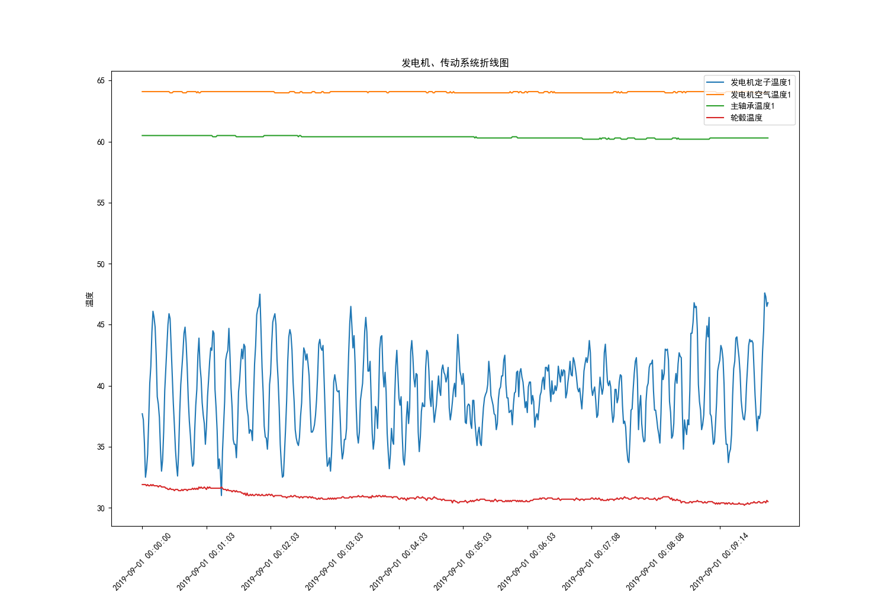

​	这里主要给出示例，也是一个简单的时间和温度的折线图变化，在这里仅仅给出十分钟的数据示例，其中一分钟取一个时间节点进行显示，具体代码如下所示，如需修改则只需要修改读取数据和处理数据的代码即可

```python
# 折线图
def pie_time_line(data, record_time, data_columns, title, flag=True):
    # 创建一个大图形，并设置图形大小
    plt.figure(figsize=(15, 10))
    plt.rcParams["font.family"] = ["SimHei"]

    # 绘制折线图
    for column in data_columns:
        d = data[column]
        plt.plot(record_time, d, label=column)

    # 添加标题和坐标轴标签
    plt.title(title)
    plt.xlabel('时间')
    plt.ylabel('温度')

    # 添加图例
    plt.legend(loc='upper right')
    # 在x轴上标注数据
    if flag:
        # 设置 x 轴刻度
        ticks_index = range(0, record_time.shape[0], 60)
        ticks_value = record_time.iloc[ticks_index]
        plt.xticks(ticks_index, ticks_value, rotation=45)
    # 显示图形
    plt.show()
    
# 将需要画图的数据单独取出
def motor_temperature_graph(data):
    record_time = data['记录时间']
    data_columns = ['发电机定子温度1', '发电机空气温度1', '主轴承温度1', '轮毂温度']
    pie_time_line(data, record_time, data_columns, '发电机、传动系统折线图')

def motor_transmission_system_analysis_data():
    # 读取数据
    data = motor_system_analysis_data(all_data())
    # 通过数据画图
    motor_temperature_graph(data)
    
if __name__ == '__main__':
    # 发电机、传动系统分析
    motor_transmission_system_analysis_data()
```

