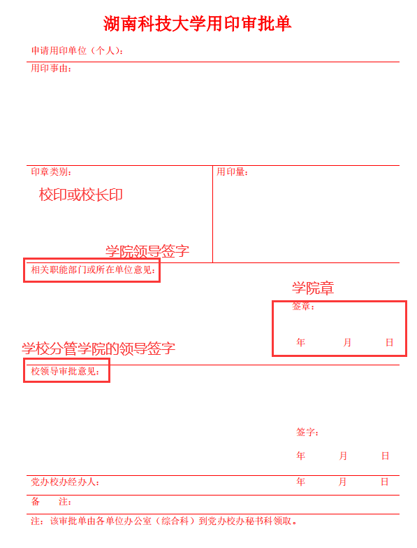
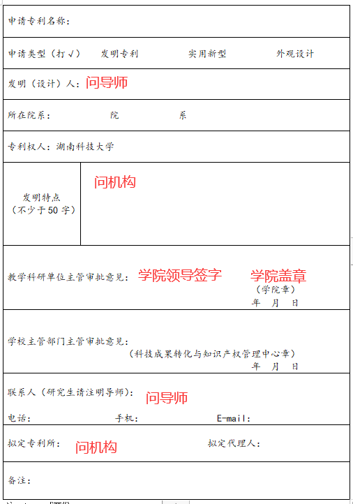

# 1. 资料准备

准备下列资料并打印：

- 专利摘要
- 承诺书
- 专利代理委托书
- 专利申请审批表
- 湖南科技大学用印审批单（专利用印使用）

**承诺书、专利代理委托书找专利委托机构要**，[专利审批表](https://github.com/cheercao/my_mkdocs/blob/master/docs/use_docs/专利审批表.doc)和[湖南科技大学用印审批单](https://github.com/cheercao/my_mkdocs/blob/master/docs/use_docs/湖南科技大学用印审批单.pdf)点击下载即可，内容写完毕后，去立德楼五楼成果转化中心办理

# 2. 内容填写

**用印审批表，需要盖学院章，需要学院领导签字，需要科技处盖章。专利申请审批表需要学院盖章，学院领导签字**

